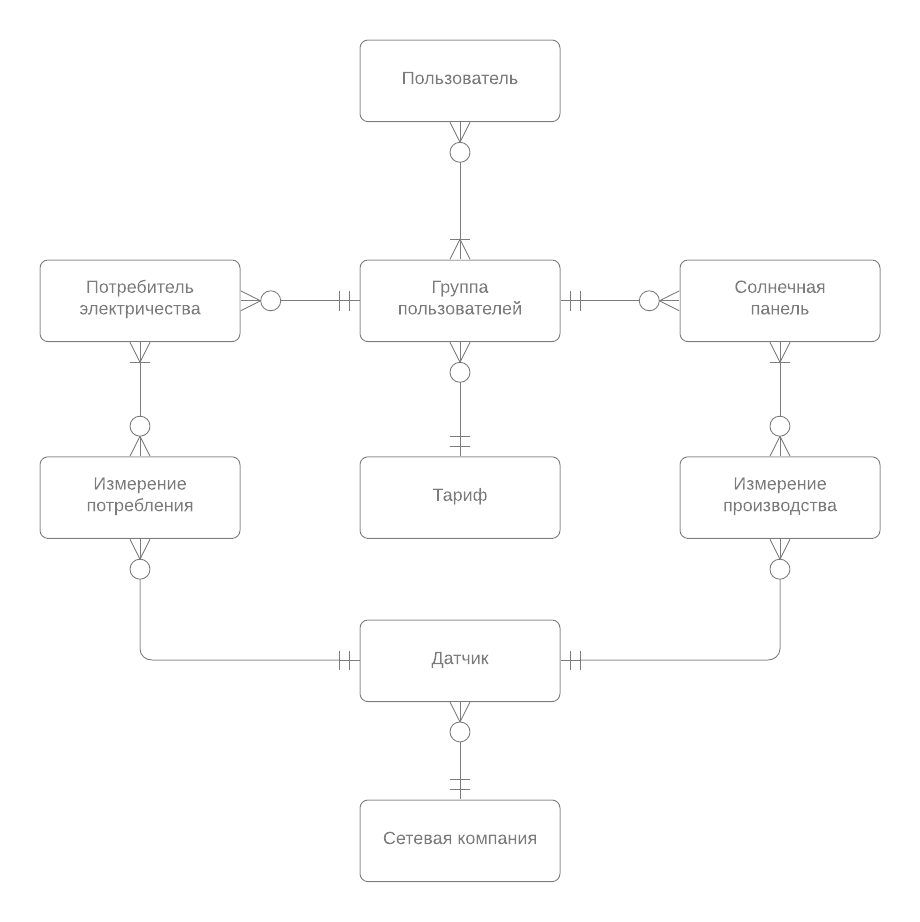

# Семестровый проект по предмету "Базы данных"
---

## Предметная область
В проекте реализована база данных системы анализа потребления в электрической системе.

Основные сущности:
* Измерение производства
* Датчик
* Сетевая компания
* Группа пользователей
* Потребитель электричества
* Солнечная палень
* Пользователь
* Тариф

## Концептуальная модель

## Логическая модель

## Физическая модель

Концептуальная, логическая и физическая модели доступны также в [документе](doc/build/main.pdf).

## Скрипты
* [DDL скрипты создания пустой БД](scripts/create.sql)
* [Скрипты заполнения данными](scripts/insert.sql)
* [Примеры смысловых запросов](scripts/requests.sql)
* [CRUD запросы](scripts/crud.sql)
* [Представления](scripts/views.sql)
* [Сложные представления](scripts/complex_views.sql)
* [Триггеры и хранимые процедуры](scripts/additions.sql)

